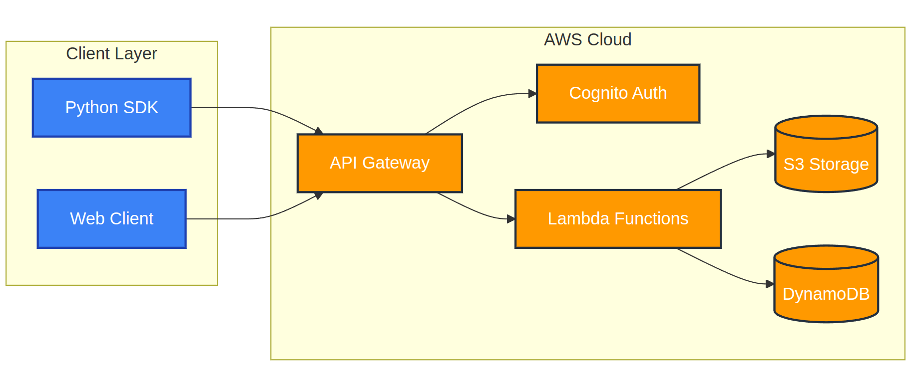
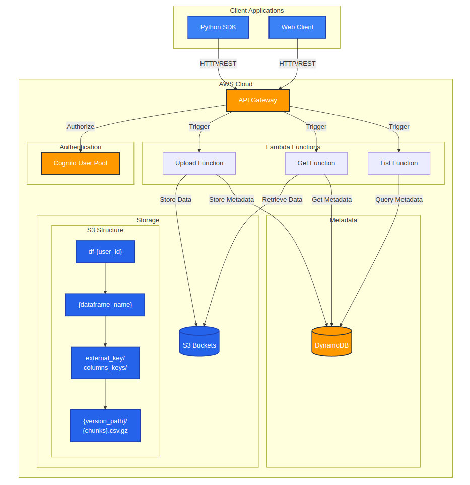

# PandasDB Backend

Serverless AWS infrastructure for storing and managing pandas DataFrames with automatic versioning, chunking, and optimized storage patterns.

At high level what it builds is the AWS Cloud (orange boxes):



In more detail about what deploys in AWS and the complete flow follows:



## Overview

PandasDB Backend provides the serverless infrastructure required by the [pandas-db-sdk](https://github.com/yourusername/pandas-db-sdk) package. It handles DataFrame storage, versioning, and retrieval through a secure API built on AWS services.

## Architecture

The system is built on AWS serverless architecture with the following components:

- **API Gateway**: RESTful API endpoints
- **Lambda Functions**: Data processing and storage management
- **S3**: DataFrame storage with automatic chunking
- **DynamoDB**: Metadata and indexing
- **Cognito**: Authentication and user management


## Storage Patterns

### 1. Date-based Partitioning
```
bucket/
└── {dataframe_name}/
    └── {date_column}/
        └── 2024-01-01/
            └── {chunk_uuid}.csv.gz
```

### 2. ID-based Partitioning
```
bucket/
└── {dataframe_name}/
    └── {id_column}/
        └── from_{min_id}_to_{max_id}/
            └── {chunk_uuid}.csv.gz
```

### 3. Version Control
```
bucket/
└── {dataframe_name}/
    └── external_key/
        └── default/
            ├── YYYY-MM-DD/
            │   └── HH:MM:SS_{chunk_uuid}.csv.gz
            └── last_key.txt
```

## API Endpoints

### Upload DataFrame
```
POST /dataframes/upload
```
Parameters:
- `dataframe`: CSV or JSON data
- `dataframe_name`: Storage path
- `columns_keys`: Partitioning configuration
- `external_key`: Version identifier
- `keep_last`: Version retention flag

### Get DataFrame
```
GET /dataframes/{name}
```
Parameters:
- `name`: DataFrame path
- `external_key`: (optional) Version filter
- `use_last`: (optional) Latest version flag

## Deployment

### Prerequisites
- AWS Account
- AWS CLI configured
- Node.js ≥ 14.x
- Serverless Framework

### Installation

1. Clone repository:
```bash
git clone https://github.com/yourusername/pandasdb-backend.git
cd pandasdb-backend
```

2. Install dependencies:
```bash
npm install
```

3. Deploy:
```bash
serverless deploy --stage prod
```

### Environment Variables

Create a `.env` file with:
```env
STAGE=prod
REGION=us-east-1
```

## Security

- User isolation through separate S3 buckets
- Cognito authentication
- Fine-grained IAM policies
- CORS configuration
- Request validation


## Monitoring

The infrastructure includes:
- CloudWatch Logs
- Lambda metrics
- API Gateway metrics
- S3 access logs
- DynamoDB metrics


## Development

### Local Testing
```bash
# Install dependencies
npm install

# Run local API
serverless offline start

# Run tests
npm test
```

### Adding New Features

1. Create new Lambda function in `handlers/`
2. Update `serverless.yml`
3. Add tests in `tests/`
4. Update documentation

## Project Structure
```
pandasdb-backend/
├── handlers/
│   ├── dataframes.py
│   └── utils.py
├── tests/
│   └── test_handlers.py
├── img/
│   ├── architecture.png
│   ├── dataflow.png
│   ├── security.png
│   └── monitoring.png
├── serverless.yml
├── requirements.txt
└── README.md
```

## Contributing

1. Fork repository
2. Create feature branch (`git checkout -b feature/amazing-feature`)
3. Commit changes (`git commit -m 'Add amazing feature'`)
4. Push to branch (`git push origin feature/amazing-feature`)
5. Open Pull Request

## License

This project is licensed under the MIT License - see the [LICENSE.txt](LICENSE.txt) file for details.

## Related Projects

- [pandas-db-sdk](https://github.com/yourusername/pandas-db-sdk): Python SDK for interacting with this backend
- [pandas](https://github.com/pandas-dev/pandas): Data analysis library

## Support

For support:
- Open an issue
- Contact maintainers
- Check documentation

## Authors

- Your Name ([@yourgithub](https://github.com/yourusername))

## Acknowledgments

- AWS Serverless Framework
- Pandas Development Team
- Contributors
